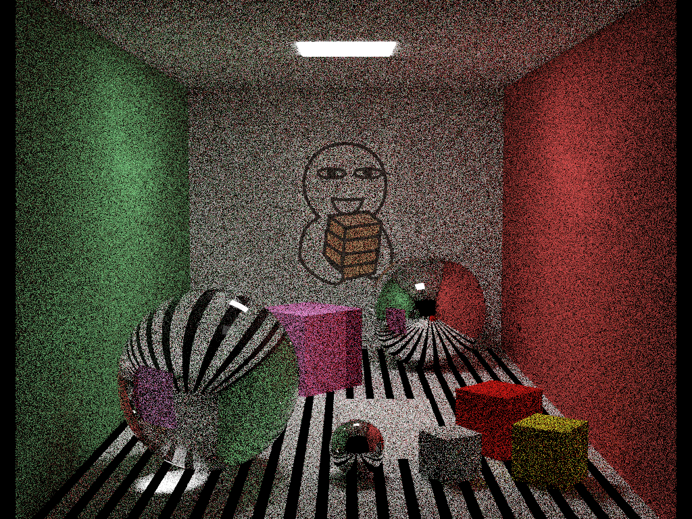
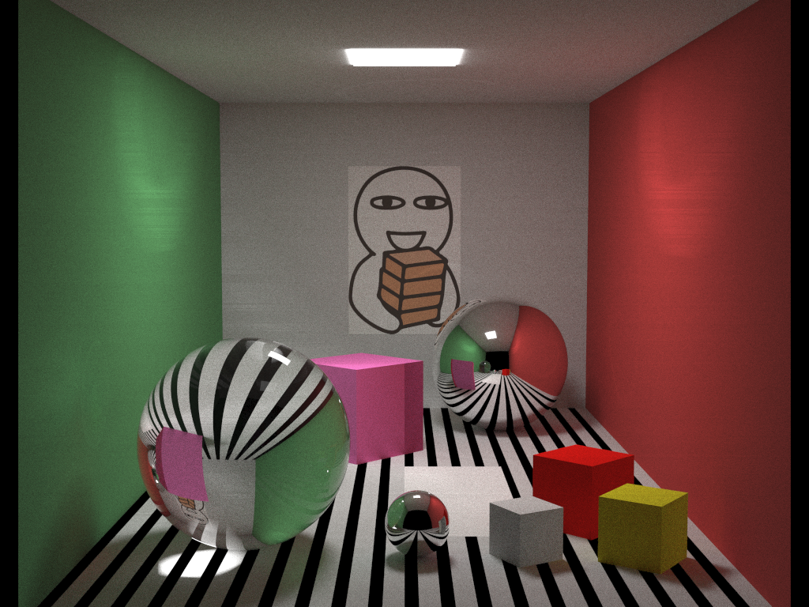

# PathTracing

A Project on Computer Graphics

## How to Run

```
mkdir build
cd build
cmake ..
./rayTracing n_samples
```

## Debug Build

```shell
mkdir debug
cd debug
cmake -DCMAKE_BUILD_TYPE=Debug ..
```

## TODO List

- [x] Scene construction
- [x] Colour
- [x] Reflection
- [x] Trasparency
- [x] Shadow
- [x] Supersampling
- [ ] Spatial data stucture

## Rendering Preview



100 samples per pixel



10000 samples per pixel

## Licence

MIT

## Reference

- http://www.kevinbeason.com/smallpt/
- https://eleni.mutantstargoat.com/portfolio/prj/pt.html
- http://cosinekitty.com/raytrace/contents.html
- https://www.scratchapixel.com/lessons/3d-basic-rendering/introduction-to-ray-tracing/how-does-it-work
- https://www.siggraph.org//education/materials/HyperGraph/raytrace/rtrace0.htm
- https://github.com/matt77hias/cpp-smallpt
